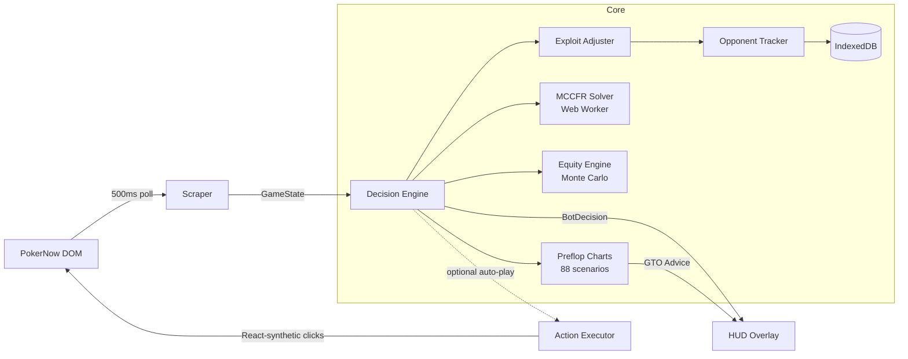
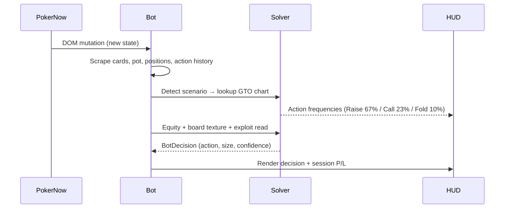

<div align="center">

# ♠️ GTO Vision

### A real-time Game-Theory-Optimal poker overlay for [PokerNow](https://www.pokernow.club)

Triton-broadcast-style strategy HUD, an in-browser MCCFR solver, 88 pro-grade preflop charts, live opponent profiling, and an interactive GTO trainer — all in a single Chrome extension.

[](https://www.typescriptlang.org/)
[](https://developer.chrome.com/docs/extensions/mv3/intro/)
[](https://webpack.js.org/)
[](LICENSE)

</div>

---

## 📺 What it looks like

Like watching a Triton Poker broadcast — except the solver read-out is for *your* hand, live, while you play.

```
┌─────────────────────────────────┐        ┌──────────────────────────────┐
│  GTO SOLVER          IN RANGE    │        │  TAG  142h                   │
│  A♠K♦   BTN vs SB 3-Bet          │        │  VP 23  PF 19  3B 7  AF 2.4  │
│  ─────────────────────────────  │        └──────────────────────────────┘
│  3-Bet  ████████████████   67%  │              ↑ live HUD on every seat
│   Call  ████████           23%  │
│   Fold  ███                10%  │        ┌──────────────────────────────┐
│                                 │        │  RAISE  $4.50      82% conf   │
└─────────────────────────────────┘        │  Geometric c-bet, dry board   │
   ↑ GTO action frequencies                 │  Equity ▓▓▓▓▓▓▓░░░  64.2%     │
                                            │  Hands 38 · +$22.50 · +$15/hr │
                                            └──────────────────────────────┘
                                                ↑ engine decision + session P/L
```

Toggle the entire HUD with **`Alt+G`**.

---

## ✨ Features

- **🎯 Triton-style GTO overlay** — for every preflop spot it renders the solver's exact action mix (Raise / Call / Fold / All-in) as animated frequency bars, with an *in-range / out-of-range* verdict on your hand.
- **🧠 88 professional preflop charts** — RFI, vs-open, vs-3bet, vs-4bet, and iso ranges for all six positions, merged from two independent pro chart packs (Greenline + Pekarstas / GG) with mixed-strategy frequencies.
- **♻️ In-browser MCCFR solver** — a from-scratch [Monte-Carlo Counterfactual Regret Minimization](https://en.wikipedia.org/wiki/Counterfactual_regret_minimization) engine running off-thread in a Web Worker, plus a postflop heuristics engine with board-texture analysis, geometric bet-sizing, and SPR awareness.
- **🃏 Fast equity engine** — a bitwise 7-card hand evaluator feeding a Monte-Carlo equity calculator for live win-percentage estimates.
- **🕵️ Live opponent profiling** — tracks VPIP / PFR / 3-bet / AF / WTSD per player, persists it in IndexedDB across sessions, and classifies each villain as **NIT · TAG · LAG · Calling Station · Maniac**.
- **⚔️ Exploit adjustments** — nudges baseline GTO toward maximally-exploitative lines based on each opponent's tendencies, with a tunable GTO↔exploit slider.
- **📈 Session tracking** — live hands played, profit/loss, and $/hr right on the overlay.
- **🎓 GTO Trainer** — a standalone study mode that drills preflop and postflop spots against the same solver ranges.

---

## 🏗️ Architecture



The decision pipeline for a single spot:



---

## 🧰 Tech stack

| Layer | Tech |
|---|---|
| Language | TypeScript 5.6 (strict) |
| Platform | Chrome Extension — Manifest V3 |
| Build | Webpack 5 + ts-loader |
| Concurrency | Web Workers (off-thread CFR) |
| Persistence | IndexedDB |
| Solver basis | MCCFR + open-source GTO chart packs |

---

## 🚀 Getting started

**Prerequisites:** Node 18+ and npm.

```bash
# 1. Install dependencies
npm install

# 2. Build the extension
npm run build      # production build → dist/
# or
npm run dev        # watch mode for development

# 3. Load it in Chrome
#    chrome://extensions  →  enable "Developer mode"
#    →  "Load unpacked"  →  select the  dist/  folder

# 4. Open a table at pokernow.club and press Alt+G
```

---

## 📁 Project structure

```
src/
├── content-script/      # DOM scraper + action executor for PokerNow
│   ├── scraper.ts        # reads cards, pot, players, action log
│   ├── executor.ts       # React-compatible click/raise automation
│   └── index.ts          # orchestrator + session tracking
├── core/
│   ├── engine.ts         # main decision engine (texture, sizing, SPR)
│   ├── cfr/              # MCCFR solver, game tree, card utils
│   ├── equity/           # 7-card evaluator + Monte-Carlo equity
│   ├── ranges/           # 88 GTO preflop charts + advisor
│   └── exploit/          # opponent tracker, profiler, adjuster
├── ui/                   # HUD overlay + popup settings panel
├── trainer/             # standalone GTO trainer
├── workers/             # off-thread CFR worker
└── storage/             # IndexedDB persistence
```

---

## 🗺️ Roadmap

- [ ] Compile [b-inary/postflop-solver](https://github.com/b-inary/postflop-solver) to WASM for full real-time postflop solving
- [ ] Range-vs-range equity visualization on the overlay
- [ ] Hand-history import + post-session leak report
- [ ] Configurable chart packs (GTO Wizard / PioSOLVER exports)

---

## ⚠️ Disclaimer

This project is built **for educational and research purposes** — to study game theory, regret-minimization algorithms, and real-time decision systems. Using automated assistance or bots may violate the terms of service of online poker platforms and, in some jurisdictions, the law. **Use it only in play-money, study, or otherwise authorized settings.** The author assumes no liability for misuse.

---

## 🙏 Credits

- Preflop ranges adapted from the open-source [poker-charts](https://github.com/AHTOOOXA/poker-charts) project (Greenline & Pekarstas packs).
- Solver design informed by [b-inary/postflop-solver](https://github.com/b-inary/postflop-solver) and the broader CFR literature.

## 📄 License

[MIT](LICENSE) © 2026 Samay Lakhani
