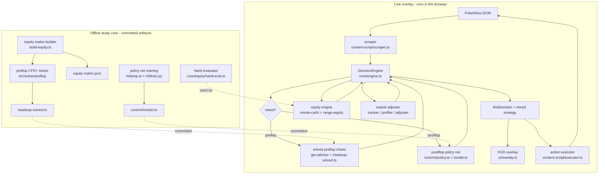

# Architecture

This project has two halves that meet at a set of committed data files.

The **offline study core** solves poker math ahead of time: a CFR+ heads-up
preflop solver, a distilled postflop policy network, an all-in equity matrix, and
a fast hand evaluator. Its job is to turn slow computation into small artifacts
that ship with the extension.

The **live overlay** runs inside the browser on pokernow.club. It scrapes table
state, asks the decision engine what to do, and surfaces the answer through a HUD
overlay (and, optionally, an action executor). At runtime it never solves
anything from scratch. It reads the precomputed charts and the policy net and
combines them with a real-time equity calculation and opponent reads.

## Data flow

## Live path, step by step

1. **DOM to GameState.** `PokerNowScraper` reads hero cards, community cards,
   stacks, blinds, positions, and the action history out of the PokerNow DOM and
   produces a `GameState` (see `src/types/poker.ts`). DOM selectors are the
   brittle part and may need updating if PokerNow changes its markup.

2. **DecisionEngine.** `core/engine.ts` orchestrates everything. It computes a
   quick Monte Carlo equity for logging and sanity checks, then branches on the
   street.

3. **Preflop: solved charts.** `decidePreflopFromGTO` calls `getGTOAdvice`
   (`core/ranges/gto-advisor.ts`), which prefers the solved heads-up charts in
   `core/ranges/headsup-solved.ts` (a real CFR+ Nash solve) when the table is
   heads-up, falls back to hand-tuned and 6-max charts otherwise, and uses the
   push/fold Nash tables when stacks are very short. The engine samples one
   action weighted by the equilibrium frequencies, so it mixes like a solver.

4. **Postflop: policy net.** `decidePostflopNet` builds a normalized `Spot` with
   the same `encodeSpot` feature module used to train the model, runs the pure-TS
   forward pass in `core/ml/policy.ts` against the committed weights in
   `core/ml/model.ts`, and masks to legal actions. A range-aware heuristic
   (`decidePostflopRanged`) is the fallback for multiway pots or any net error,
   and hard anti-blunder guards sit over both (for example, never value-bet a
   non-flush hand into a monotone board).

5. **Equity engine.** `core/equity/` provides the fast hand evaluator
   (`hand-eval.ts`), Monte Carlo equity (`monte-carlo.ts`), and equity versus a
   concrete continuing range (`range-equity.ts`). The postflop heuristic scores
   hero equity against villain's modeled continuing range rather than a random
   hand.

6. **Exploit adjuster.** Postflop only, the engine identifies the villain,
   profiles them (nit / TAG / LAG / fish / maniac) from tracked stats, and shifts
   the mixed strategy toward the exploitative line when confidence is high.
   Preflop stays pure GTO so the sampled equilibrium action is never overridden.

7. **Output.** The resulting `BotDecision` carries an action, a size, and the
   full mixed strategy. The HUD overlay (`ui/overlay.ts`) renders the
   recommendation and ranges; the action executor (`content-script/executor.ts`)
   can click the corresponding PokerNow button when enabled.

## Offline study core

- **Preflop solver** (`src/solver/`): a generic CFR / CFR+ / MCCFR engine with
  Kuhn and Leduc test games, plus a dedicated heads-up preflop tree and fast
  solver under `src/solver/preflop/`. It emits `core/ranges/headsup-solved.ts`.
- **Equity matrix** (`src/solver/preflop/build-equity.ts`): computes the 169x169
  all-in equity matrix that the preflop solve consumes, cached to
  `equity-matrix.json`.
- **Policy net** (`ml/`): `prep.ts` builds training tensors from the PokerBench
  postflop dataset using the shared `encodeSpot`, `train.py` trains a small
  NumPy MLP, and the weights are exported as base64 Float32 into
  `core/ml/model.ts` so the extension imports them directly with no fetch or CSP
  issues.
- **Hand evaluator** (`core/equity/hand-eval.ts`): the shared 7-card evaluator
  used by both the equity engine at runtime and the solver tooling offline.

The two halves are deliberately decoupled. Nothing in the offline core runs in
the browser; the live path only ever reads its committed output.
